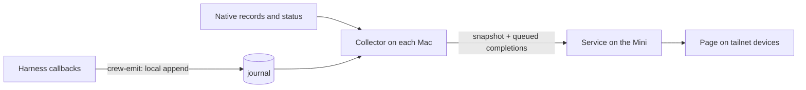

# Crew

A readable web page for understanding Claude Code, Codex CLI, and Hermes Agent
activity across a Mac Mini and MacBook Pro on a tailnet.

The first version shows current activity by machine, harness, and project,
expandable subagents beneath their main sessions, and recently finished requests
with their final responses available to read. Collectors on both Macs report to
the Mini, which hosts the shared page. One repository groups its clones,
branches, and worktrees into one project.

## How it fits together



- `crew/emit.c` is the only code that runs inside an agent callback. It appends
  one metadata-only line to a local journal and returns the neutral hook result.
- `crew/adapters/` turn native evidence into the common observation model in
  `crew/model.py`: Claude transcripts and live-session registry, the Codex daemon
  and rollouts, and the Hermes observer plugin in `crew/hermes_plugin/`.
- `crew/collector.py` polls the adapters, keeps finished requests in a SQLite
  outbox until the Mini has committed them, and uploads a fresh snapshot.
- `crew/service.py` stores reports in SQLite, resolves project identity, and
  serves the read API plus the built page from `web/`.

Requirements and decisions live in the
[specification](docs/work/agent-activity/spec.md); evidence and its limits in the
[validation report](docs/work/agent-activity/validation.md); delivery state in the
[plan](docs/work/agent-activity/plan.md).

## Develop

Needs `uv`, `pnpm`, `just`, and a C compiler.

```sh
just setup    # pinned Python and web dependencies
just check    # ruff, pytest, page type-check and tests, API contract
just build    # build the page into web/dist
```

`just api` regenerates `web/openapi.json` and the page's types after a change to
`crew/model.py` or the routes.

## Run it

Each Mac has one settings file, `~/Library/Application Support/Crew/config.toml`
(mode `600`; it holds the upload token). `CREW_HOME` moves that directory.

On the Mini, which runs the service and its own collector:

```toml
machine_id = "mini"
machine_name = "Mac Mini"
token = "<token for mini>"
viewer_logins = ["<your Tailscale login>"]

[collectors]            # sha256 of each collector token -> the machine it may report for
"<hash>" = "mini"
"<hash>" = "book"
```

On the MacBook, which only reports:

```toml
machine_id = "book"
machine_name = "MacBook Pro"
service_url = "https://<mini>.<tailnet>.ts.net:8787"
token = "<token for book>"
```

`uv run python -m crew token` prints a new token with its hash.

The LaunchAgents run from the checkout they were installed from, so give each
Mac a checkout of its own that your day-to-day branch switching never touches:

```sh
git clone git@github.com:mascah/crew.git ~/Library/Application\ Support/Crew/app
cd ~/Library/Application\ Support/Crew/app
```

Then, on each Mac from that checkout:

```sh
uv sync --no-dev
uv run python -m crew install hooks      # compiles crew-emit; add --dry-run to preview
uv run python -m crew install hermes     # where Hermes is installed
uv run python -m crew install collector  # per-user LaunchAgent
```

and on the Mini only:

```sh
just build
uv run python -m crew install service
tailscale serve --bg --https=8787 http://127.0.0.1:8787
```

The service listens on loopback. Tailscale Serve provides HTTPS and the account
identity; only `viewer_logins` may read the page, and a collector token only
permits reporting for its own machine.

Hook entries are appended beside existing ones in `~/.claude/settings.json` and
`~/.codex/hooks.json` (a `.before-crew` copy is kept). Codex asks you to review
new hooks before running them; Crew leaves that to Codex. Every `install`
command accepts `--remove`.

To update, `git pull` in that checkout, repeat `uv sync --no-dev` (and
`just build` on the Mini), and rerun the `install collector` / `install service`
commands, which reload the agents.

`uv run python -m crew project` lists projects with their identity keys;
`uv run python -m crew project <project-id> <key>` maps an ambiguous checkout or
remote to an existing project.

## More

- [Office predecessor review](docs/work/office-review/discovery.md)
- [Agent workflow](docs/agents/workflow.md)
- [GitHub issues](https://github.com/mascah/crew/issues)
