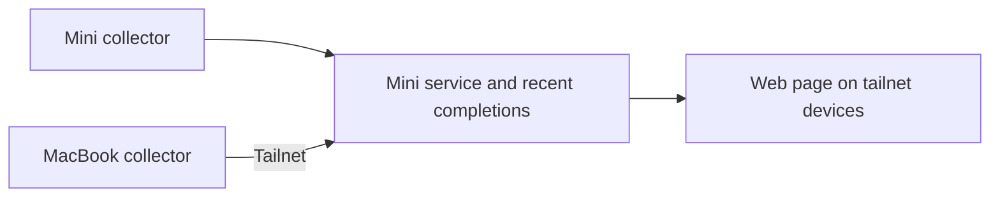

# Crew: current agent activity and recent completions

Status: initial product scope agreed. The behavior below records the
conversation, including the collector/reporting arrangement, observation-hook
design, project meaning, and expandable subagent view. Exact hook coverage,
performance, and implementation details remain to be validated. The author
intends implementation to continue from the MacBook and deferred probe checks
during the Mini documentation handoff. See [delivery and handoff](plan.md).

## Problem

The author runs agents on a Mac Mini and MacBook Pro, sometimes using the
MacBook to SSH into the Mini. They want one readable web page accessible from
their tailnet devices to understand activity across both execution machines.
They want a fresh start informed by the older Office project, with explicit
confirmation before carrying over any Office behavior or technical approach.

The [Office review](../office-review/discovery.md) records source findings and
possible reuse. This specification owns Crew's current product scope.

## Intended behavior

### Current activity is the main view

Cover Claude Code, Codex CLI, and Nous Research Hermes Agent on both Macs.
Make activity viewable by machine, harness, and project. Both machines execute
agent work; neither is only a viewer.

An activity entry identifies the execution machine, harness, and project,
shows the agent's current state, and provides a short description of its current
activity, such as running tests or editing a file. The intended display states
are working, waiting for the author, and idle. Exact mappings from each harness's
signals remain to be established.

Machine attribution refers to where the agent executes. Starting a Codex CLI
session on the Mini through SSH from the MacBook places it under the Mini.
Local MacBook agents appear under the MacBook.

Start with a readable page. The author is open to pixel characters or other
playful visual elements; specific artwork and motion have not been selected.

### Main sessions with expandable subagents

The author selected expandable subagents for the first version. Each main
session is an overview entry that can be expanded to show the helper agents it
spawned. Each helper shows its own state and current activity beneath its parent.

For example, a main Codex session is working on Crew while one helper reads code
and another runs tests. The collapsed entry keeps the main session readable;
expanding it reveals both helpers and their individual activity.

Parent-child membership comes from harness evidence. Sharing a name, project,
or working folder does not establish that one session is another's subagent.
Collection of those relationships still needs validation for each harness.

### Project grouping

The author confirmed that one Git repository means one project across its
clones, branches, and worktrees on both Macs. For example, the main Crew
checkout on the Mini, a Crew worktree used by an agent, and the Crew clone on
the MacBook all appear under Crew. Each activity entry still identifies its
execution machine and checkout.

Work outside a Git repository groups by its working folder. A shared display
name alone is insufficient to merge unrelated repositories or folders.
Combining several repositories into a broader project is outside the selected
project meaning. The mechanism for identifying the same repository across
machines remains an implementation choice to establish.

### Recent completions support catching up

Include a small secondary view of recently finished requests. The author
confirmed that a completion means **the agent finished its latest request**,
with its final response available to read.

This is completion of a response cycle within a conversation. The same agent
can accept another request later. A completion entry does not assert verified
task success, completed project work, or that the agent process has exited.

For example, an agent finishes a request with a response explaining changes and
remaining issues. That request appears as a recent completion, and the author
can read that response. If the author sends another request in the same session,
its new activity appears in the current view.

The duration or size of the recent list, and whether to show an excerpt before
opening the final response, remain presentation choices to settle.

## Constraints and decisions

- Initial execution machines: Mac Mini and MacBook Pro on the author's tailnet.
- Initial harnesses: Claude Code, Codex CLI, Nous Research Hermes Agent.
- Access: one page usable from the author's tailnet devices.
- Priority: current activity first, recent completions secondary.
- Visual direction: readable page; playful details are optional.
- Agent presentation: main sessions with expandable subagents, including each
  helper's state and current activity, in the first version.
- Meaning of completion: finished latest request, with final response available.
- Meaning of project: one Git repository across clones, branches, and worktrees;
  work outside Git groups by its working folder.
- Arrangement: a background collector on each Mac reports local activity to a
  service on the Mini; the Mini hosts the shared page and recent completions.
- Availability: the Mini must be online for the page to work. A machine that
  stops reporting shows when it was last seen.
- Collection direction: combine saved session records with observation hooks.
  The author accepted the design after discussing performance impact: short
  local event writes, collector-owned uploads, incremental reads/batched updates,
  and background or in-process callbacks where suitable. Actual overhead has
  not been measured and must be measured before claiming it is small.
- The author permits updating Hermes if needed for the required event support.
  No upgrade has been performed; the required version has not been selected.
- Office is evidence for possible reuse. Its features, metrics, workflow,
  infrastructure, and implementation are not inherited automatically.
- The exact stack, harness collection method, tailnet serving mechanism, and
  storage have not been selected. Harness integration claims still require
  current runtime evidence.

## Acceptance of the agreed behavior

- Local agents on both Macs appear in one activity view with their execution
  machines, harnesses, and projects identifiable.
- Selecting a machine, harness, or project makes that subset understandable.
- Clones and worktrees of the same repository on either Mac appear under one
  project; unrelated repositories with matching folder names remain distinct.
- Work outside a Git repository appears under its working folder.
- An agent started on the Mini from an SSH connection appears under the Mini;
  simultaneous local work on the MacBook appears under the MacBook.
- A current activity entry gives the author a readable state and short activity
  description. Source gaps must be resolved before a state is promised across
  all three harnesses.
- A main session expands to show its subagents beneath it, with each helper's
  individual state and activity. Collapsing it restores the main-session overview.
- A helper is associated with its evidenced parent, without being duplicated
  as a separate main session or joined by matching names/directories alone.
- A finished latest request appears in recent completions, with its final
  response accessible. A further request in the same session can become active.
- Recent completion entries communicate request completion, without asserting
  that project work was verified or that the session exited.
- The page can be read and navigated from the author's desktop, tablet, and
  phone; decoration supports the readable presentation.
- When a machine stops reporting, the page shows when it was last seen rather
  than presenting its last observations as confirmed current activity.

## Confirmed collection and hosting arrangement

Run a small background collector on each Mac, observing that machine's
existing harness sessions. Each collector sends observations to a service on
the Mini. The Mini serves the single web page and retains the information needed
for recent completions. The author explicitly confirmed this arrangement after
its requirements and availability limits were explained. This adopts Office's
general reporting direction, without adopting its implementation or other features.

This setup puts local collection beside the local agent data and gives every
viewer one address. It requires background software on both Macs. The Mini
must be available for the page to work; a MacBook that sleeps stops reporting.
Show when its observations were last received, with a not-reporting state until
it reconnects.

Collection observes existing work without requesting model turns or sending
inputs to agents. Saved records supply context and final responses; observation
hooks supply available lifecycle/activity signals. Exact mappings and handling
unavailable signals still need investigation. No existing Office code,
LaunchAgent, hard-coded address, or Bench integration has been adopted.

Collectors send observations to the Mini rather than using Mini-to-MacBook SSH
as the collection transport. The author's normal SSH workflow can continue.

### Performance implications and design goals

Observation does not imply zero overhead. A command hook can launch a process
for every event, and a synchronous callback adds its execution time to the
agent's operation. Background hooks still use CPU/memory and can queue or finish
out of order. Collectors also perform local I/O and consume laptop resources.

Keep callbacks limited to emitting a small local event. The collector handles
networking, batching, saved-record reads, and rendering data. Minimize process
startup/import work; use background hooks where their lifecycle behavior is
suitable, or in-process observers where the harness supports them. Read record
changes incrementally rather than repeatedly scanning complete histories.

The design goal is small, bounded overhead and continued agent responsiveness
when the Mini or tailnet is unavailable. Actual hook latency and collector
CPU/memory/battery implications need measurement before making a performance
claim. See the [collection investigation](discovery.md#performance-implications).

## Other open questions

The [collection investigation](discovery.md) records native-data evidence and a
confirmed design to combine saved records with observation hooks.
Current documentation does not establish all installed-version coverage or
actual performance.

- Which collection sources accurately reveal working, waiting for the author,
  idle, and finished-request states for each installed CLI?
- Which hooks should run inline or in the background, and what is their measured
  overhead on the two Macs?
- Which native parent-child identifiers and lifecycle signals provide correct
  subagent grouping for each installed harness, including resumed sessions?
- Which repository identity mechanism reliably groups clones/worktrees across
  machines and distinguishes unrelated repositories? The project meaning is settled.
- How much recent completion history should remain available?
- Which lightweight playful visuals suit the readable page?

## Outside the agreed first scope

No decision has been made to include full transcript history/search, Bench task
bookkeeping, time attribution, token/cost dashboards, agent launching, sending
prompts, acting on approvals, scheduling, or remote terminal control. These can
be considered individually if the author wants them.
