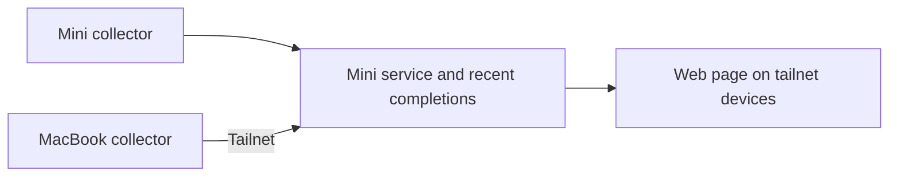

# Crew: current agent activity and recent completions

Status: the six original questions have selected design answers in the
[decision review](#reviewed-decisions-for-issue-1). The author selected Python/
FastAPI and React/TypeScript/Vite on 2026-10-07. Storage/recovery, private access,
freshness, and startup are settled in the [foundation decisions](#implementation-foundations).
Runtime coverage and deployed behavior remain implementation/release checks.
The collector arrangement, observation-hook direction, project meaning, and
expandable subagent view remain agreed. Design choices are grounded in saved
validation evidence; complete runtime coverage and production performance remain
implementation/release gates. The
[validation report](validation.md) records tested sources, measured overhead,
required Hermes compatibility changes, and remaining integration checks.
See [delivery and handoff](plan.md).

## Problem

The author runs agents on a Mac Mini and MacBook Pro, sometimes using the
MacBook to SSH into the Mini. They want one readable web page accessible from
their tailnet devices to understand activity across both execution machines.
They want a fresh start informed by the older Office project, with explicit
confirmation before carrying over any Office behavior or technical approach.

The [Office review](../office-review/discovery.md) records source findings and
possible reuse. This specification owns Crew's current product scope.

## Intended behavior

### Current activity is the main view

Cover Claude Code, Codex CLI, and Nous Research Hermes Agent on both Macs.
Make activity viewable by machine, harness, and project. Both machines execute
agent work; neither is only a viewer.

An activity entry identifies the execution machine, harness, and project,
shows the agent's current state, and provides a short description of its current
activity, such as running tests or editing a file. The intended display states
are working, waiting for the author, and idle. Use the evidenced mappings below;
unavailable or unvalidated signals remain an explicit observation gap.

Machine attribution refers to where the agent executes. Starting a Codex CLI
session on the Mini through SSH from the MacBook places it under the Mini.
Local MacBook agents appear under the MacBook.

Use a readable page with small pixel avatars and restrained working animation.
Text labels carry state and activity; respect reduced-motion preferences.
Specific character artwork remains a page-design choice.

### Main sessions with expandable subagents

The author selected expandable subagents for the first version. Each main
session is an overview entry that can be expanded to show the helper agents it
spawned. Each helper shows its own state and current activity beneath its parent.

For example, a main Codex session is working on Crew while one helper reads code
and another runs tests. The collapsed entry keeps the main session readable;
expanding it reveals both helpers and their individual activity.

Parent-child membership comes from harness evidence. Sharing a name, project,
or working folder does not establish that one session is another's subagent.
Initial native relationship and resume cases have been exercised; nested and
restart/backfill behavior remain release checks in the validation report.

### Project grouping

The author confirmed that one Git repository means one project across its
clones, branches, and worktrees on both Macs. For example, the main Crew
checkout on the Mini, a Crew worktree used by an agent, and the Crew clone on
the MacBook all appear under Crew. Each activity entry still identifies its
execution machine and checkout.

Work outside a Git repository groups by its working folder. A shared display
name alone is insufficient to merge unrelated repositories or folders.
Combining several repositories into a broader project is outside the selected
project meaning. The mechanism for identifying the same repository across
machines uses the remote/common-directory mechanism and explicit mappings below.

### Recent completions support catching up

Include a small secondary view of recently finished requests. The author
confirmed that a completion means **the agent finished its latest request**,
with its final response available to read.

This is completion of a response cycle within a conversation. The same agent
can accept another request later. A completion entry does not assert verified
task success, completed project work, or that the agent process has exited.

For example, an agent finishes a request with a response explaining changes and
remaining issues. That request appears as a recent completion, and the author
can read that response. If the author sends another request in the same session,
its new activity appears in the current view.

Keep seven days of completions with a configurable 1,000-entry service-wide cap,
expiring the oldest when either limit is reached. Show the newest 20 initially,
with access to the remaining retained entries and their final responses.

## Constraints and decisions

- Initial execution machines: Mac Mini and MacBook Pro on the author's tailnet.
- Initial harnesses: Claude Code, Codex CLI, Nous Research Hermes Agent.
- Access: one page usable from the author's tailnet devices.
- Priority: current activity first, recent completions secondary.
- Visual direction: readable page with small pixel avatars, restrained working
  animation, and reduced-motion support.
- Recent history: seven days, with a configurable 1,000-entry cap and 20 entries
  shown initially.
- Agent presentation: main sessions with expandable subagents, including each
  helper's state and current activity, in the first version.
- Meaning of completion: finished latest request, with final response available.
- Meaning of project: one Git repository across clones, branches, and worktrees;
  work outside Git groups by its working folder.
- Arrangement: a background collector on each Mac reports local activity to a
  service on the Mini; the Mini hosts the shared page and recent completions.
- Availability: the Mini must be online for the page to work. A machine that
  stops reporting shows when it was last seen.
- Collection direction: combine saved session records with observation hooks.
  The author accepted the design after discussing performance impact: short
  local event writes, collector-owned uploads, incremental reads/batched updates,
  and background or in-process callbacks where suitable. Warm native callback
  intervals and a small collector prototype have now been measured on both Macs.
  Cold costs and the deployed collector's aggregate impact remain separate checks.
- The author permits updating Hermes if needed for the required event support.
  No active upgrade has been performed. The required generic wait observer
  contract was exercised in the scratch revision recorded below.
- Office is evidence for possible reuse. Its features, metrics, workflow,
  infrastructure, and implementation are not inherited automatically.
- Collection sources, repository identity policy, and the Python/FastAPI plus
  React/TypeScript/Vite stack are selected below. Storage/outage recovery,
  serving/access, startup, and freshness are selected in the foundation decisions.
  Harness integration claims still require
  evidence for the actual installed versions and execution surfaces.

## Acceptance of the agreed behavior

- Local agents on both Macs appear in one activity view with their execution
  machines, harnesses, and projects identifiable.
- Selecting a machine, harness, or project makes that subset understandable.
- Clones and worktrees of the same repository on either Mac appear under one
  project; unrelated repositories with matching folder names remain distinct.
- Work outside a Git repository appears under its working folder.
- An agent started on the Mini from an SSH connection appears under the Mini;
  simultaneous local work on the MacBook appears under the MacBook.
- A current activity entry gives the author a readable state and short activity
  description. Source gaps must be resolved before a state is promised across
  all three harnesses.
- A long tool remains working while observation is healthy. Automatic approval
  decisions and readiness for another prompt do not become human waits.
- A main session expands to show its subagents beneath it, with each helper's
  individual state and activity. Collapsing it restores the main-session overview.
- A helper is associated with its evidenced parent, without being duplicated
  as a separate main session or joined by matching names/directories alone.
  Resuming the same native helper updates that entry and preserves membership.
- A finished latest request appears in recent completions, with its final
  response accessible. A further request in the same session can become active.
- Recent completion entries communicate request completion, without asserting
  that project work was verified or that the session exited.
- Stop-hook continuation produces only the final settled completion, with its
  delivered response. An interruption or partial response produces no finished
  entry. Replaying the same request does not duplicate its completion.
- Completions expire by completion time after seven days or when the configured
  cap is exceeded; the default cap is 1,000 across the service. The newest 20
  appear initially, all retained final responses can be opened, and retained
  entries survive service restart.
- The page can be read and navigated from the author's desktop, tablet, and
  phone. Pixel avatars stay stable through resume; state and activity remain
  readable with reduced motion enabled.
- When a machine stops reporting, the page shows when it was last seen rather
  than presenting its last observations as confirmed current activity.
- Observation sends no prompts, continuation requests, or permission decisions
  to agents and preserves existing hooks and review/trust behavior. Reporting
  failures cause no network waits in agent callbacks; an adapter's observation
  error leaves other adapters usable.

## Confirmed collection and hosting arrangement

Run a small background collector on each Mac, observing that machine's
existing harness sessions. Each collector sends observations to a service on
the Mini. The Mini serves the single web page and retains the information needed
for recent completions. The author explicitly confirmed this arrangement after
its requirements and availability limits were explained. This adopts Office's
general reporting direction, without adopting its implementation or other features.

This setup puts local collection beside the local agent data and gives every
viewer one address. It requires background software on both Macs. The Mini
must be available for the page to work; a MacBook that sleeps stops reporting.
Show when its observations were last received, with a not-reporting state until
it reconnects.

Collection observes existing work without requesting model turns or sending
inputs to agents. Saved records supply context and final responses; observation
hooks supply available lifecycle/activity signals. Use the selected mappings
below and expose unavailable signals explicitly. No existing Office code,
LaunchAgent, hard-coded address, or Bench integration has been adopted.

Collectors send observations to the Mini rather than using Mini-to-MacBook SSH
as the collection transport. The author's normal SSH workflow can continue.

### Performance implications and design goals

Observation does not imply zero overhead. A command hook can launch a process
for every event, and a synchronous callback adds its execution time to the
agent's operation. Background hooks still use CPU/memory and can queue or finish
out of order. Collectors also perform local I/O and consume laptop resources.

Keep callbacks limited to emitting a small local event. The collector handles
networking, batching, saved-record reads, and rendering data. Minimize process
startup/import work; use background hooks where their lifecycle behavior is
suitable, or in-process observers where the harness supports them. Read record
changes incrementally rather than repeatedly scanning complete histories.

The design goal is small, bounded overhead and continued agent responsiveness
when the Mini or tailnet is unavailable. Saved native-hook and prototype
measurements support the placement choices below; cold activation and deployed
collector CPU/memory/I/O/battery impact still require measurement. See the
[measured overhead and limits](validation.md#measured-overhead).

## Reviewed decisions for issue #1

Reviewed 2026-10-07 against the saved report, scratch summaries, and native TUI
records. These are the six questions from the issue's original specification.
The [validation report](validation.md) owns passing probes, failed experiments,
measurements, and unexercised surfaces. The
[inventory](discovery.md#two-machine-shaping-inventory) records the earlier source
inspection. The author selected seven-day retention and pixel avatars, and
authorized disposable live probes on both Macs. That authorization
covers temporary probe code/configuration and model turns, with existing hooks
and active sessions preserved; it does not authorize the production application.

| Original question | Selected answer | Review verdict |
| --- | --- | --- |
| Which sources establish state and completion? | Native Codex daemon status and turn/history records; Claude surface-specific TUI/hosted boundaries plus records/hooks; Hermes turn observers plus paired actual human-input observers. | Source design resolved. Saved cases support these paths; standalone Codex, other Claude variants, and an actual Hermes package on both Macs remain gates. |
| Which hooks run inline/background, and at what cost? | Bounded local writes for necessary lifecycle edges; native records for routine tools; collector-owned parsing/networking; in-process Hermes observers. Warm targets: p95 20 ms / p99 50 ms. | Placement resolved. Measured warm native intervals fit the targets; cold 166–283 ms outliers and deployed resource/battery impact remain gates. |
| How are subagents grouped, including resume? | Machine/harness/native IDs and evidenced parent links; repeated observations of the same helper update one entry. | Identity design resolved. Codex/Claude same-helper continuation passed on both Macs; Hermes delegation passed on the Mini. Nested, background, restart/backfill, and Hermes helper resume remain gates. |
| How are repositories matched across machines? | Persisted Crew project ID; machine-scoped Git common directory; normalized unambiguous `origin`; explicit mappings take precedence. | Policy resolved. Both-machine clone/worktree and same-name fixtures support it; ambiguous remotes remain distinct until mapped. |
| How much completion history remains? | Seven days; configurable 1,000-entry service-wide cap; newest 20 initially; retained final responses available. | Product choice and defaults settled. Expiry, deduplication, and durability require implementation checks. |
| Which playful visuals fit the readable page? | Small pixel avatars, harness accents, restrained working animation, text labels, reduced motion. | Visual direction settled. Artwork and responsive/accessibility checks belong to page implementation. |

No product question remains open from this original set. The separately reviewed
implementation foundations are also selected below. The following sections own the
design details; [remaining implementation and release checks](plan.md#remaining-implementation-and-release-checks)
own the work required to demonstrate them. Shaping completion does not mark
issue #1 implemented or establish full harness compatibility.

### State and completion evidence

Give the same meanings to states across all three adapters:

- **Working:** an observed request is active without an outstanding human wait,
  including model processing, tool execution, and harness-driven continuation.
- **Waiting for the author:** an active request is blocked on an actual human
  input or approval. A permission-policy check that is answered automatically
  does not establish a human wait. Ordinary readiness for the next prompt is idle.
- **Idle:** a live session is ready for another request, with no active request
  or outstanding human wait. A quiet log or an exited process does not establish
  idle. Unknown liveness or incomplete observation is shown explicitly.
- **Finished request:** a response cycle has settled and its delivered final
  response is recoverable. This is a request outcome, separate from the session's
  current state. Interruptions, partial replies, and pending stop-hook
  continuation must not produce a finished entry. A final response describing
  unsuccessful project work still counts; Crew does not verify task success.

Keep request identity, session lifetime, human waits, and reporter freshness
separate. Retain a working state during a long tool while observation is healthy;
mark the observation stale when reporting stops. A resumed conversation keeps
its native session identity and can start another request.

Use native records for recovery and activity, plus hooks for transitions that
the records cannot establish promptly. Select the following sources for
implementation within their evidenced execution surfaces:

| Harness | Selected source mapping | Saved evidence and release limits |
| --- | --- | --- |
| Codex CLI | For loaded sessions, read the existing daemon over Unix WebSocket: native active/idle status and `waitingOnApproval`/`waitingOnUserInput` flags. Native turn settlement/history and rollout `task_complete`/`turn_aborted` recover outcomes; records supply activity and responses. | Separate passive reads, human waits, automation, continuation, main/helper resume, and interruption were exercised. Standalone sessions outside that daemon and restart/backfill still need coverage. `PermissionRequest` alone is not a human wait. |
| Claude Code | Native messages/tool records plus hooks. For the tested TUI, `system:turn_duration` follows settled continuation; recover the request's delivered final response. `Notification:permission_prompt` opens an observed manual permission wait; reconcile its closure with correlated native evidence. A hosted CLI instead supplies terminal `result`; check `is_error` and reason. | TUI continuation and manual approval passed on both tested binaries; the approval fixture then emitted `PostToolUse` and settled. Hosted waits and main/helper resume also passed. Hosted waits did not emit the TUI notification after seven seconds. TUI questions, denial/cancellation, interruption, and network/other wait variants remain checks. |
| Hermes Agent | `pre_llm_call` opens a turn; tool observers supply activity; `post_llm_call`/native history recover output; canonical `on_session_end` closes the turn with outcome flags. The generic human-input request/resolved pair supplies actual waits. | Installed Mini normal/resume/delegation passed. Verified scratch source `7951ddd7297a284d6da48804241ee05a8a0c621c` produced a matched interactive clarify pair. Update/install a build with that contract and validate its managed package on both Macs. |

If an adapter cannot establish a transition, report its observation gap. Keep
the other adapters usable. Full three-harness support remains an acceptance
requirement rather than being silently reduced to inferred status.

### Hook placement and overhead

Prefer the background native-status reader for loaded Codex daemon sessions;
the passive collector must not call resume, turn-start, or approval methods.
Keep native history/records for backfill and final responses. Discovery hooks can
supplement this path; routine tool hooks are unnecessary where records suffice.

Use inline, bounded local writes for remaining state edges: session start/resume/end,
request start, human-wait open/close, interruption, and subagent start/stop.
For Codex/Claude, candidate hooks are `SessionStart`, `UserPromptSubmit`,
`PermissionRequest`, `Stop`, `SessionEnd`, and `SubagentStart`/`SubagentStop`,
plus Codex `Interrupt` and Claude `Notification`, `StopFailure`, and the needed
question/elicitation observers. Some are only candidate signals, as above.
`PermissionRequest` can correlate a review but does not establish a human wait.
For Hermes, prefer small in-process plugin observers for turn, wait, delegation,
reset, and finalize events over a subprocess for every event.

Parsing records, recovering responses, retrying uploads, and maintaining the
view belong in the background collector. Prefer native tool records for routine
activity. Add tool hooks only where validation exposes a missing signal; an
asynchronous tool observer is suitable only if delayed, reordered, or cancelled
execution can be reconciled from native evidence. Do not depend on asynchronous
callbacks as the sole source of final lifecycle transitions.

Preserve existing hooks and review/trust behavior. Return each harness's neutral
result without model-visible context or policy decisions. Collector outages
must not cause network waits in callbacks. Local write failure must leave normal
agent behavior intact and become an observation error.

The [measured native intervals](validation.md#measured-overhead) for the corrected
writer had p95 11/15 ms for Codex and 12.642/19.609 ms for Claude on MacBook/Mini,
respectively. The twenty-tool workload incurred 314–450 ms across 43 observers.
Avoid that cost for routine activity when native records/status already suffice.
Hermes native-dispatch replay on the Mini had p95 0.157 ms; it is not a MacBook
or live-model performance result.

Use warm design targets of p95 20 ms and p99 50 ms per callback. Newly built
writers also incurred cold costs of 166–283 ms, so the full cold path has not met
those targets. Evaluate cold activation separately and remove work from the
agent path where possible. Production measurement must include serialization,
startup, native-history scanning, storage, upload retries, backlog, and sleep
recovery. Battery impact remains unmeasured; the MacBook probe was on AC.

### Native subagent grouping

Use machine, harness, and native session identity to scope relationships. A hook
invocation is an observation, not a new agent. Repeated start/resume observations
for the same native helper update one entry; a new native helper gets a new entry.

| Harness | Parent-child candidates | Recovery and limits |
| --- | --- | --- |
| Codex CLI | Child rollout ID plus `source.subagent.thread_spawn.parent_thread_id`; hook parent `session_id` and child `agent_id`. | Preserve the link across resumed turns. Other structured subagent source forms need separate evidence; neither nickname nor depth alone establishes a parent. |
| Claude Code | Main-session transcript location plus native child `agent_id`/transcript filename; metadata `parentAgentId` when present supports nested membership. | Same-helper continuation through `SendMessage` retained its child ID under the same main session on both Macs. Key the helper by those IDs, not each start event. `parentUuid` is a message link, not agent parentage. Recover delivered `SubagentHandback` reports separately from closing text. |
| Hermes Agent | `subagent_start` links parent/child session and subagent IDs to the parent turn; `subagent_stop` closes the run. | Backfill using `parent_session_id` with `_delegate_from`; a generic parent-session link can represent a branch/reset instead of delegation. Preserve those distinctions on resume. |

An unrecognized helper relationship remains unresolved. Reuse saved main-session
and Codex/Claude same-helper resume evidence for adapter checks; target nested
and background helpers, interruption, collector restart, and Hermes helper
resume for missing coverage in the handoff.

### Repository identity

Use a persisted Crew project ID with explicit mappings taking precedence
over automatic discovery. Use Git's absolute common directory to associate a
local repository's worktrees; scope that local identity to its execution machine.
For cross-machine matching, use a normalized, unambiguous `origin` fetch remote
from `git remote get-url --all origin`. Match recognized SSH/HTTPS spellings of
the same hosting endpoint and repository path, removing credentials and the
provider's optional `.git` suffix. Preserve host/namespace/repository distinctions;
do not apply provider-specific case or transport rules to arbitrary Git servers.

For example, `git@github.com:mascah/crew.git` and
`https://github.com/mascah/crew` suggest one project. Another owner's `crew`
repository and a fork with its own `origin` remain separate, even if an `upstream`
remote or commit history is shared. The two inspected Crew clones have the same
SSH `origin` today.

Missing or ambiguous remotes, SSH aliases, local-path remotes, renamed/moved
repositories, and conflicting identities require an explicit mapping to the
same Crew project ID. Until mapped, keep them distinct using machine and common
directory. A cached mapping preserves identity while offline; changing a remote
must not silently rewrite retained history. Work outside Git uses machine and
canonical working folder. Resolve submodules as their own repositories.

Clone/worktree and unrelated-same-name fixtures passed on both Macs. This
chooses a conservative mechanism with a small configuration cost. A host
API lookup could later improve rename handling; it is not required for the first
version. Folder names, first commits, and a union of all remotes are rejected as
automatic identities because they can merge unrelated repositories or forks.

### Recent history

The author selected retaining finished requests and their final responses for
seven days. Use the saved defaults of a configurable safety cap of 1,000 entries
across the service; expire the oldest when either limit is reached. Show the
newest 20 initially with access to the remaining retained entries. Deduplicate
replay and reconnects by request identity, expire by completion time rather than
upload time, and preserve retained responses across service restart. Retention
does not delete native harness history. An excerpt can help scanning, but opening
an entry must expose its retained final response.

### Playful visuals

The author selected pixel avatars. Use small avatars beside readable session
rows, with harness accents and restrained working animation. State labels,
machine/project names, activity, and expansion controls carry the meaning.
Waiting should be noticeable without
pulsing urgency; idle and stale observations remain visually quiet. Respect
reduced motion and keep avatars stable through resume. Exact character artwork
can be chosen during page design. An animated office scene is outside this scope.

### Implementation choices and validation boundary

The stack and operating foundations below are selected. Exact dependency
versions, module details, and character artwork can follow those decisions.
This review does not reopen the six original decisions. The
[handoff](plan.md#remaining-implementation-and-release-checks)
separates unexercised source coverage, recovery, package compatibility, deployed
performance, and page checks. Passing daemon/hosted/scratch cases do not establish
other execution surfaces. Runtime and release claims require the corresponding
evidence during implementation and release validation.

## Implementation foundations

Status: selected on 2026-10-07. The author accepted the storage/recovery limits,
freshness timings, and access restricted to their own account through Tailscale
Serve, and directed startup to match when agents can run in the current setup.
The read-only Mini startup investigation supports the user-session choice below.
On 2026-10-07
the author corrected the readiness conclusion: leaving the stack to an agent
during implementation is not the intended handoff. The original six answers
stand; consequential technical choices should be reviewed first. The
[supporting research](discovery.md#implementation-foundation-research) separates
documented capabilities from the recommendations here.

### Selected stack and comparison

The author selected **Python collectors and FastAPI service, with a React/
TypeScript UI built using Vite**. The operating choices are selected separately
below. `platform-django` is an authorized tooling reference;
use its relevant development patterns without importing Django-specific setup.

| Option | Advantage for Crew | Cost/tradeoff |
| --- | --- | --- |
| Python collectors and FastAPI service; React/TypeScript UI built with Vite | Python suits file/record processing and the native Hermes observer; a typed, component-based UI makes changing filters, expanding helpers, and reading responses easier to maintain. FastAPI's OpenAPI schema can supply generated UI types. | Two language/tool chains and a frontend build. The API contract must be checked across them. |
| TypeScript collectors and Fastify service; React/TypeScript UI built with Vite | One main application language and shared report/view types across service and browser. | The Hermes plugin still uses Python. SQLite driver/runtime packaging needs a deliberate choice; current Node built-in SQLite documentation labels it a release candidate. |
| Python collectors and FastAPI service; plain HTML/CSS/JavaScript UI | Smaller frontend dependency surface and build/setup cost. | More manual management of changing rows, filters, expansion state, and accessibility as the page evolves. |

Rationale for the selected stack: Crew's harder work is native evidence
collection and reconciliation; Python is a practical fit for that work. React
is justified by the interactive session tree and the three views. This is an
engineering judgment, not a measured performance advantage over TypeScript.
Serve the built UI from the Mini service, so production has one service address
and no separate frontend server. Node is build tooling in this option; the
running collectors and service use Python. Keep callback writers minimal and
independent of these long-running processes, as already selected.

### Four operating decisions

| Choice | Selected answer | Author-visible consequence |
| --- | --- | --- |
| Storage/outage recovery | SQLite on the Mini's local disk plus local SQLite outboxes/checkpoints on each Mac. Acknowledge uploads after a durable Mini commit; replay safely by request/event identity. Pending-completion bounds: seven days, 1,000 completions, and 256 MiB of queued payload per machine, configurable; coalesce replaceable current-state updates. | Retained completions/project mappings survive restart, and brief completions during a Mini outage can arrive later. Exceeding a queue limit expires oldest pending completions and exposes a gap; retained responses remain complete. The database is not shared over a network filesystem. |
| Private serving/access | Loopback service on the Mini, proxied through private HTTPS Tailscale Serve; viewer access only for the author's Tailscale account. Give each collector its own upload credential scoped to its machine. | One private URL, without a separate Crew login. Requires HTTPS, appropriate tailnet access rules, and an application viewer allowlist based on Serve identity. Collector credentials permit reporting, without granting browser response-reading access. Existing configuration still needs checking. |
| Background startup | Per-user macOS LaunchAgents for each collector and the Mini service, with graphical and SSH/background-session support and dedicated pinned environments. Match Hermes's `Aqua`/`Background` session types and ensure only one collector owns a machine's observations. | Starts with the relevant user session and restarts after failure. The Mini has automatic login configured, so its user session is expected to start after reboot without a manual login. Cover SSH-only agent work too. Boot-before-any-user-session availability is outside the selected setup; validate automatic-login and background activation during delivery. |
| Freshness | Healthy-path display target: within five seconds of observable native evidence; ten-second reporter heartbeat; mark reporting stale after thirty seconds without receipt. Make these configurable and use the Mini's receipt time. | A delayed native permission signal can add its own delay. Stale observations remain readable with their age and do not imply current working/idle state. Measure the targets during delivery. |

Storage/recovery details:

- Commit source checkpoints with the local outbox entries they represent.
  Remove acknowledged uploads only after the Mini has committed them durably;
  a lost acknowledgment causes replay, not duplicate completion entries.
- Preserve original observation/completion timestamps. On reconnect, reconcile
  current native state and send a fresh snapshot; replayed historical working
  observations must not make old work look current. Retention remains based on
  completion time, not the reconnection time.
- The seven-day/1,000-completion service retention already selected remains
  independent of the per-machine outage queue limits. Queue payload bytes are
  bounded; SQLite/WAL/checkpoint/log overhead must also be managed and measured.
- Use local SQLite with explicit durable transactions. If WAL mode is used,
  require a runtime with the documented WAL-reset fix, and manage checkpoints;
  verify the deployed SQLite version rather than assuming the Python version
  establishes it. This is packaging/release work, not an unresolved author choice.
- Centralize selected identity/state/activity metadata and complete retained
  final responses; keep raw transcripts on their source machines. Build fresh
  Crew modules and evaluate any Office code reuse explicitly.

Private serving details: require the configured author
identity for browser/API reads through Serve; distinguish that from authenticated
collector ingestion. Do not treat missing Serve identity headers as an authorized
viewer. Tagged collector devices can report with their upload credentials.
Local processes use the same explicit role checks; loopback alone is not a
reason to grant unauthenticated uploads or response reads.

Freshness targets concern healthy, actively viewed operation. The five-second
target starts when the harness emits evidence Crew can observe, not when an
unobservable internal transition occurs. Reporter heartbeats establish transport
health; per-adapter observation freshness remains separate. Reconnecting or
reopening the browser must first fetch a current snapshot before displaying
retained values as live. Idle tools do not require a new record every heartbeat.

Startup is tied to user sessions, rather than only the desktop login window.
The Mini's installed Hermes gateway is a user LaunchAgent supporting both
`Aqua` and `Background`, with no installed system gateway job. Its current
Tailscale variant is the standalone GUI client, which does not offer pre-login
tailnet connectivity. However, the Mini has automatic login configured for the
same account and FileVault is off. Its existing arrangement is therefore
expected to create the user session automatically after reboot, then start
Hermes and Tailscale without manual login. Crew should start alongside them.
This is a configuration-based expectation, not a tested reboot result. Preserve
the current login settings; no boot-time service migration is selected.
An SSH/background session can still start agents through
another reachable network path; Crew must collect that work locally and upload
when reporting becomes available. Do not assume that declaring `Background`
alone proves automatic activation: verify the SSH-only lifecycle and source
recovery in implementation. Moving Hermes/Tailscale to unattended boot services
would be a separate operating change, not part of this decision.

The [startup investigation](discovery.md#mini-startup-investigation) records
configuration evidence and the absence of a reboot test. All four foundation
choices are settled. Exact
dependency pins, table schemas, module/file names, and avatar characters remain
implementation details within the selected approach. The existing release
checks still apply; a stack decision cannot establish missing runtime evidence.

### Tooling inspiration

Review of the referenced `platform-django` working tree found `uv` and locked
Python dependencies, Ruff, mypy, pytest, pnpm, ESLint/Prettier, TypeScript checks,
Playwright, `just` recipes, and OpenAPI-generated TypeScript client patterns.
Recommend the applicable tools for Crew with a small command surface and a
generated API contract check. Adapt configuration to FastAPI and the smaller
application; choose compatible dependency pins during setup. The
[research notes](discovery.md#platform-django-tooling-reference) record the
inspected files. No tooling or runtime dependency has been installed yet.

## Outside the agreed first scope

No decision has been made to include full transcript history/search, Bench task
bookkeeping, time attribution, token/cost dashboards, agent launching, sending
prompts, acting on approvals, scheduling, or remote terminal control. These can
be considered individually if the author wants them.
