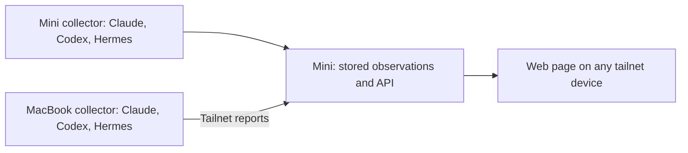

# Office review for Crew

Reviewed 2026-10-06. This is a source review and a proposed product direction,
not an approved implementation specification.

## Outcome and scope record

The current confirmed product scope is owned by the
[agent activity specification](../agent-activity/spec.md). The details below
record the review context; technical recommendations remain candidates.

Crew should give the author one web page, reachable from devices on their
tailnet, that makes agent activity across their machines easy to understand.
The initial monitored machines are the Mac Mini and MacBook Pro. Agents run on
both machines, including work started on the Mini through SSH from the MacBook.
The author wants views by machine, harness, and project.

The initial harnesses are Claude Code, Codex CLI, and Nous Research Hermes
Agent. The author confirmed Codex CLI and the Hermes identity during this
review. Codex desktop support has not been requested.

The author selected a readable page as the starting visual direction and is
open to pixel characters or other ways to make it visually fun.

The author does not feel they understand all of Office's behavior and explicitly
requires confirmation before carrying any of it forward. Every Office feature,
technical approach, metric, and workflow below is a candidate for explanation
and confirmation. The recommendations in this review are not selected Crew
requirements or permission to implement them. Only the scope stated above is
confirmed.

For attribution, the relevant machine is the machine executing the agent.
An agent started through an SSH connection to the Mini belongs to the Mini;
the MacBook can simultaneously have its own local agents and serve as a viewer.

> 🧠 **From Hindsight memory (Key decisions and rationale)** — Crew previously
> chose to treat Office as a reference without inheriting its Bench workflow.
> This is also confirmed in [Crew's current workflow](../../agents/workflow.md).

## Recommendation

Propose a fresh application around a common observation model and a collector
on each execution machine. Office's reporting direction, inexpensive
observation approach, and lessons about displaying activity are useful candidates
to explain and confirm. Selected Claude parsing utilities might be adapted after
their behavior is checked against current records and reuse is confirmed.

Office's complete application assumes Claude and Bench throughout discovery,
identity, project placement, status, history, and presentation. Extending that
application would require changes across those areas and would preserve several
limitations described below. A fresh core provides a clearer place for three
harness adapters and the three requested views. This recommendation does not
select an implementation language or frontend framework.

## What Office actually did, in plain language

Office combined several capabilities that can be considered independently:

| Capability | What the author saw | What supplied it |
| --- | --- | --- |
| Current sessions and state | Claude agents labeled busy, idle, blocked, or finished. | Claude's session listing; recent transcript activity for child agents. These signals did not all have the same reliability. |
| Last action | A file, command, search, or other action the agent most recently performed; sometimes its last response or an existing summary. | Conversation records Claude already wrote. Office did not ask a model to create each dashboard update. |
| Project rooms | Agents placed into named project boxes, with pixel people above readable rows. | Working directories and Bench's project/session registrations. |
| Multiple machines | MacBook activity displayed alongside Mini activity, with machine labels and a warning when reports stopped arriving. | A program on the MacBook sent its observations to the Mini. The Mini served the page. |
| Past activity | A project roster and timeline showing agents that had come and gone. | Saved local Claude conversations. The project detail endpoint did not combine remote history. |
| Estimated activity and usage | Time bars for editing, reading, tests, and other actions, plus output-token and turn counts. | Estimates from gaps between conversation records and reported usage. These were not exact work-time or monetary-cost measurements. |
| Bench task progress | Completed task counts, agent roles, current runs, and next actions. | Bench's project run files and execution ledger, rather than generic Claude session behavior. |
| Bench execution details | Running commands, results waiting to be read, messages awaiting acknowledgement, waits for shared resources such as the browser, and context/usage warnings. | Additional bookkeeping written by Bench's launcher and execution helpers. |
| Background operation | The page's server restarted after an exit, reporters retried failures, and the layout adapted to narrow screens. | A macOS background-service template, retry code, and responsive page rules. |

The author's request does not select all of these capabilities. Subsequent
shaping selected current activity as the main view and recent completions as a
secondary view. The author confirmed that a completion means an agent finished
its latest request, with the final response available to read. The
[specification](../agent-activity/spec.md) owns that scope. Other history, metrics,
Bench integration, artwork, and collection/hosting choices remain candidates.

## Evidence reviewed

Office's application working tree was clean on `main`, at `1591934`, whose
latest commits record completion of its v2 release. Reviewed:

- [README](../../../../office/README.md), including hosting and reporter setup.
- [Application](../../../../office/office.py): collection, transcript folding,
  Bench joins, host merging, project history, HTTP handlers, and selftest cases.
- [Page](../../../../office/office.html): overview, project detail, status
  rendering, freshness indicators, and phone layout rules.
- [LaunchAgent template](../../../../office/launchd/com.mascah.office.plist).
- [Product context](../../../../office/docs/blueprint/CONTEXT.md),
  [decisions](../../../../office/docs/blueprint/DECISIONS.md), and
  [specification](../../../../office/docs/blueprint/SPEC.md).
- [Reporter API checks](../../../../office/tests/report_api.py), smoke and
  visual check sources, and
  [recorded human observations](../../../../office/docs/plan/v2/runs/r1-v2-2026-09-10/notes/human-C-two-host.md).
- Current primary documentation for the three harnesses and Tailscale; selected
  installed Hermes source files to check available collection primitives.

No application was started, no harness session was invoked, and no Office
checks were run. In particular, Office's launchd check restarts the installed
service. Historical release evidence is distinguished from current validation.

## Candidates found in Office

| Part | Verified behavior | Possible use for Crew, pending confirmation |
| --- | --- | --- |
| Central dashboard and local reporters | `report_once()` collects local data and POSTs a snapshot; `merge_hosts()` merges reports with the Mini's snapshot. | Consider having each execution machine report its own observations to the Mini. This reduces dependence on remote SSH access for collection. |
| Reporter recovery | `report_forever()` logs connection failures and retries. Silent hosts retain their last observations and acquire a stale marker. | Consider retries, last seen, retained observations, explicit freshness, and collector health. |
| Observation from existing data | Office reads Claude's session listing and transcript files plus Bench records, without requesting model summaries. | Recommend monitoring that incurs no model turns. Use existing summaries when available and literal activity labels elsewhere. |
| Incremental transcript parsing | `Transcript.update()` reads from a byte offset, waits for complete JSONL lines, skips malformed JSON, and resets after detected truncation. | Useful foundation for append-only readers. The record interpretation remains specific to Claude; replacement files and lifecycle transitions need further work. |
| Activity labels and attention | The page shows the last tool/file/command, final text, queued input, and busy/idle/blocked indicators. | Consider readable current activity and reasons for needing attention. Distinguish a finished turn from a completed task or ended session. |
| Overview and detail | Project rooms lead to a roster and historical timeline. | Consider the navigation concept, with machine, harness, and project as independent dimensions of the same sessions. |
| macOS operation | A LaunchAgent supplies an explicit executable path, working directory, PATH, logs, and restart behavior. | Reuse the operational lessons for collectors on both Macs and the Mini's server; regenerate machine-specific configuration. |
| Failure examples | Existing checks cover bad reports, size limits, self-report duplication, retries, stale hosts, worktree placement, and incremental parsing. | Reuse the scenarios as future acceptance examples. Office's tests assert Office's own payloads and Bench behavior. |

## Limitations to address in a fresh design

1. **Harness support is embedded in the core.** Sources are `claude agents
   --json`, Claude JSONL records, Claude team files, and Bench's execution
   ledger. There is no harness field or adapter boundary. Codex and Hermes
   require their own record and lifecycle interpretations.

2. **Project identity depends on Bench and names.** `merge_hosts()` merges
   registered rooms by project name; unlisted rooms use `(host, cwd)`.
   Consequently, ordinary clones of the same project on two machines can stay
   separate, while different projects with the same name can merge. Worktree
   normalization only strips Claude's `/.claude/worktrees/` convention.

3. **Remote project detail is missing.** The overview includes reporter data,
   but `/api/project` calls `project_snapshot(cwd)`, which reads only the
   server's local transcripts and run files. Clicking a MacBook room cannot
   retrieve the MacBook's complete roster and history through that endpoint.

4. **Remote observations are volatile snapshots.** `Handler.reports` stores
   only the latest report per host in memory. Server restarts discard those
   reports until reporters reconnect. Intermediate events between snapshots
   are not retained centrally, and remote history is not collected.

5. **Stale observations still look active in totals.** The page dims stale
   host rows, but `render()` still counts their recorded busy/blocked states
   and includes them in the room's busy predicate. A last observed busy agent
   on a disconnected machine can continue contributing to current busy totals.

6. **Report freshness trusts the reporter's clock.** Host staleness uses the
   snapshot's `at` value against the Mini's clock, rather than the time the
   Mini received a report. Clock differences can misstate connection health.
   Report validation checks only the outer shape; it does not validate nested
   records or provide schema/version/sequence handling.

7. **Missing observation can look like missing activity.** Partial Claude
   profile failures are skipped; only a failure with no returned rows becomes
   a top-level error. Remote snapshot errors are not propagated into host
   health by `merge_hosts()`. The transcript reader always uses the default
   Claude home even though discovery can query alternate config directories.

8. **Metrics carry specific assumptions.** Activity duration is an estimate
   from transcript gaps, capped at ten minutes. Background jobs and parallel
   tools are not measured as exact durations. Bench's integrated/verified task
   counts cannot serve as generic harness completion counts. Ledger usage can
   display unknown, but transcript output tokens default missing usage to zero.

These are observations from the checkout. They have not been reproduced against
the running service, and this review does not change Office.

## Collection options for the three harnesses

Use one adapter per harness, returning common session identity, lifecycle,
activity, and evidence freshness. Support configurable profile/data locations.
One adapter failing should leave the other adapters' observations available and
display its own error.

| Harness | Evidence and candidate sources | What remains to establish |
| --- | --- | --- |
| Claude Code | Office provides a concrete transcript reader and session discovery implementation. Current official hooks include tool and lifecycle events, with `PermissionRequest` and notification events offering permission signals. | Recheck the undocumented session-list command and current transcript semantics. Determine whether passive reads provide sufficient status or observer hooks are needed. |
| Codex CLI | Official documentation describes persisted thread logs, read/list APIs, and runtime notifications for loaded threads. Installed Hermes code contains a Codex rollout parser for session ID, cwd, messages, and tool-call records. | Prove collection of independently running CLI sessions, turn completion, long tools, approvals, interruptions, and child sessions. A separate app-server's loaded-thread status is not evidence that it observes every CLI process. |
| Hermes Agent | Official documentation describes session/message storage in `state.db` and CLI hooks. Installed source includes hook payloads with session ID, cwd, and profile, plus activity metadata and a live-session registry. | Check local database fields and update timing, profile discovery, and the distinction between live ownership and busy work. Evaluate passive reads first; hooks are an option if needed for timely events. |

Sources: [Claude hooks](https://code.claude.com/docs/en/hooks),
[official OpenAI App Server documentation](https://learn.chatgpt.com/docs/app-server),
[Hermes sessions](https://hermes-agent.nousresearch.com/docs/user-guide/sessions),
and [Hermes hooks](https://hermes-agent.nousresearch.com/docs/user-guide/features/hooks).
These establish possible integration surfaces, not validated Crew integrations.

Local supporting evidence is in
`~/.hermes/hermes-agent/hermes_cli/foreign_sessions.py`,
`agent/shell_hooks.py`, `agent/session_activity.py`, and
`hermes_cli/active_sessions.py`. The foreign-session importer writes to Hermes
and is not a collection API for Crew. The registry snapshot helper can prune
and rewrite dead entries, so its name alone does not establish read-only behavior.
Only source inspection was performed.

## Proposed shape

Start with a current-activity overview and recent session detail. Machine,
harness, and project filters should compose, with an option to group the same
results by any of those dimensions. A row should identify its machine, harness,
project, session, state, last activity, last observation, and attention reason
when available. Parent/child relationships should be retained where observable.

Recommended distinctions:

- **Machine:** a stable collector identity with a changeable display name.
- **Harness:** Claude Code, Codex CLI, or Hermes Agent; model/provider is a
  separate optional attribute.
- **Session:** a harness-native conversation, keyed by machine, harness, and
  native session ID. Display names and working directories are not identities.
- **Project:** a logical project shared across machines and worktrees, with
  local checkout mappings. Canonical Git remotes can suggest identity; explicit
  mappings should resolve absent remotes, forks, and deliberate groupings.
- **Turn:** a response cycle within a session. A completed turn does not prove
  the project task is complete or that the session exited.
- **Freshness:** when the collector last observed the source and when the
  server last received its report. Connection health and agent state are
  separate facts.

For hosting, recommend a local service on the Mini published through Tailscale
Serve, giving devices a stable HTTPS name on the tailnet. This avoids inheriting
Office's hard-coded HTTP address. Serve can proxy a loopback service through a
tailnet HTTPS URL; actual tailnet configuration and device access remain to be
validated. [Tailscale Serve documentation](https://tailscale.com/docs/reference/examples/serve)

Prefer durable observations on the Mini, with a bounded local replay buffer on
collectors if recent history matters during server outages. Snapshots alone are
a cheaper first option if only the current picture is required. A small local
database is sufficient in principle; a database choice and retention policy
have not been selected.

## Proposed acceptance examples

These are recommendations for shaping, not inherited Office release obligations.

- Claude runs locally on the MacBook while Codex runs on the Mini through an SSH
  session. Both appear at one URL with their execution machines correctly shown.
- Hermes, Claude, and Codex work on the same project across both Macs. The project
  view shows them together, while machine and harness views isolate each subset.
- Different repositories share a directory basename. They remain distinct;
  worktrees and different paths for one mapped project group together.
- A session needs approval or a reply. The page shows the observed reason, or an
  explicit unknown state when the source does not provide enough evidence.
- A long tool produces no new output for several minutes. Lack of fresh output
  alone does not change confirmed running work into idle or completed work.
- The MacBook sleeps or becomes unreachable. Its last observations remain visible
  with their age, contribute no confirmed current busy count, and recover when
  reporting resumes. The page does not claim to know why reporting stopped.
- A collector's Claude adapter fails while its Codex adapter works. Claude
  collection is visibly degraded, Codex stays visible, and a live heartbeat does
  not imply that every harness was collected successfully.
- The Mini's service restarts. Retained observations remain available with honest
  freshness; resumed reporting updates them without duplicating sessions/events.
- A brief session completes between dashboard refreshes. Its completion appears
  in recent history if the chosen collection source and history scope support it.
- A project detail page opened from a phone includes both machines' observations
  and can be read and navigated without relying on hover.
- Refreshing or collecting observations requests no model turns and sends no
  inputs or control decisions to agents.

## Open choices and suggested boundaries

Adoption requires the author's explicit confirmation after the relevant Office
behavior or proposed alternative is explained. Current activity and recent
request completions are now selected product behaviors. The author also
confirmed collectors on both Macs reporting to a Mini-hosted page, with last-seen
information when a machine stops reporting. The
[specification](../agent-activity/spec.md) owns those decisions. Other technical
approaches and additional Office capabilities remain candidates.

The starting visual direction is settled: a readable activity page. The author
is open to pixel characters or another playful treatment. Recommend compact
agent avatars, distinct harness accents, and subtle activity animation alongside
readable rows/cards. Pixel characters can be used as avatars without requiring
a full office scene. Specific artwork and motion remain to be designed.

Recent request completions with readable final responses are selected. The
retention window and size of that view are not yet specified. Full transcript
browsing/search would add collection, retention, and presentation work. Whether
harness observer hooks are acceptable if passive reads leave status gaps also
remains open. Collection choices should follow a bounded investigation against
the author's installed CLI versions on both Macs.

Suggested initial boundaries: observation of the three CLI harnesses on these two
Macs, a private tailnet page, current activity and recent detail. Agent launching,
prompting, approval actions, scheduling, remote terminal control, Bench-specific
bookkeeping, exact time accounting, cost accounting, and monitoring additional
hosts are separate potential capabilities. These boundaries are recommendations,
not decisions attributed to the author.

## Historical validation limits

Office's recorded v2 human observation says MacBook reports appeared in the
browser. It explicitly waived a Mini reboot test and did not record real laptop
sleep behavior or iPad/iPhone screenshots. Local stale-report checks and browser
emulation were recorded separately. That supports the existence of the reporting
approach, without proving present operation or all-device reliability for Crew.
